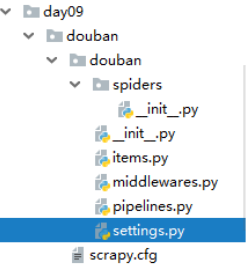
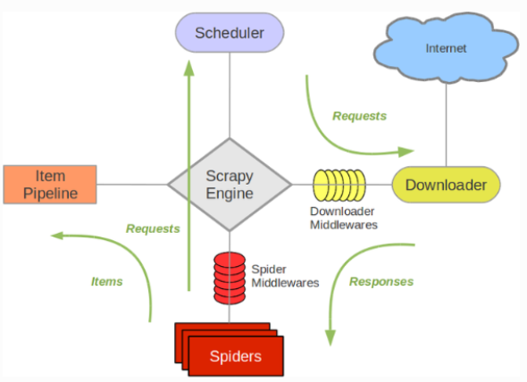

# Scrapy框架
[Scrapy 0.25 文档](https://scrapy-chs.readthedocs.io/zh_CN/latest/)
## 安装
1.pywin32   http://sourceforge.net/projects/pywin32/    #选择对应版本    (用Anaconda拷过来的安装包安的pywin32)  
2.Twisted   http://www.lfd.uci.edu/~gohlke/pythonlibs/#twisted   #选择对应版本
把下载文件放在项目中，pip install **.whl （对应的pip install Twisted-18.9.0-cp36-cp36m-win32.whl）  
3.pip install Scrapy  
## 概述

1.创建一个Scrapy项目  

2.定义提取的Item  

3.编写爬取网站的spider并提取ltem  

4.编写ltem Pipeline来存储提取到的Item(即数据)  

Scrapy由Python编写。如果您刚接触并且好奇这门]语言的特性以及Scrapy的详情，对于已经熟悉其他语言并且想快速学习Python的编程老手，我们推荐Learn Python The Hard Way,对于想从Python开始学习的编程新手，非程序员的Python学习资料列表将是您的选择。

## 文件
* items.py
	* 数据：先创建数据（模型），以一个对象的形式存储，可以在里边写两个方法
* middlewares.py
	* 中间件：添加额外功能 (钩子函数)
* pipelines.py
	* 管道：数据会输出，输出到piplines.py 管道里，爬一个输出一个，输出一个存一个
* settings.py
	* 对爬虫进行设置

## 步骤
  
先运行 spiders 里的爬虫文件；然后保存数据类型在items.py；然后数据会输出，输出到piplines.py 管道里，爬一个输出一个，输出一个存一个，还可以继续创建管道。
每个文件都有不同的功能。
```
## 步骤
# 1.创建项目   scrapy startproject tutorial(项目名称)
# 2.增加items.py  创建数据模型
# 3.创建爬虫文件      scrapy genspider dmoz(爬虫名称)   站点(域名)  “爬虫的主力”
# 4.运行      scrapy crawl dmoz(爬虫名称)  在项目里的任何位置都可以运行【有时会出现问题：处理方法：pip install pypiwin32或pip3 install pypiwin32 或 python -m pip install pypiwin32}】
# scrapt.cfg   配置项
# spiders 文件里边放的是爬虫的所有内容，只要有__init__.py  就证明是一个包，可以被调用。
# douban  也是一个包
```
## 运行流程、架构概览
[架构概览](https://scrapy-chs.readthedocs.io/zh_CN/latest/topics/architecture.html#)

### 组件
Scrapy Engine  
引擎负责控制数据流在系统中所有组件中流动，并在相应动作发生时触发事件。 详细内容查看下面的数据流(Data Flow)部分。  

调度器(Scheduler)  
调度器从引擎接受request并将他们入队，以便之后引擎请求他们时提供给引擎。

下载器(Downloader)  
下载器负责获取页面数据并提供给引擎，而后提供给spider。

Spiders  
Spider是Scrapy用户编写用于分析response并提取item(即获取到的item)或额外跟进的URL的类。 每个spider负责处理一个特定(或一些)网站。 更多内容请看 Spiders 。  

Item Pipeline  
Item Pipeline负责处理被spider提取出来的item。典型的处理有清理、 验证及持久化(例如存取到数据库中)。 更多内容查看 Item Pipeline 。  

下载器中间件(Downloader middlewares)  
下载器中间件是在引擎及下载器之间的特定钩子(specific hook)，处理Downloader传递给引擎的response。 其提供了一个简便的机制，通过插入自定义代码来扩展Scrapy功能。更多内容请看 下载器中间件(Downloader Middleware) 。  

Spider中间件(Spider middlewares)  
Spider中间件是在引擎及Spider之间的特定钩子(specific hook)，处理spider的输入(response)和输出(items及requests)。 其提供了一个简便的机制，通过插入自定义代码来扩展Scrapy功能。更多内容请看 Spider中间件(Middleware) 。  

### 数据流(Data flow)  
Scrapy中的数据流由执行引擎控制，其过程如下:  

引擎打开一个网站(open a domain)，找到处理该网站的Spider并向该spider请求第一个要爬取的URL(s)。  
引擎从Spider中获取到第一个要爬取的URL并在调度器(Scheduler)以Request调度。  
引擎向调度器请求下一个要爬取的URL。  
调度器返回下一个要爬取的URL给引擎，引擎将URL通过下载中间件(请求(request)方向)转发给下载器(Downloader)。  
一旦页面下载完毕，下载器生成一个该页面的Response，并将其通过下载中间件(返回(response)方向)发送给引擎。  
引擎从下载器中接收到Response并通过Spider中间件(输入方向)发送给Spider处理。  
Spider处理Response并返回爬取到的Item及(跟进的)新的Request给引擎。  
引擎将(Spider返回的)爬取到的Item给Item Pipeline，将(Spider返回的)Request给调度器。  
(从第二步)重复直到调度器中没有更多地request，引擎关闭该网站。  
## 事件驱动网络(Event-driven networking)
Scrapy基于事件驱动网络框架 Twisted 编写。因此，Scrapy基于并发性考虑由非阻塞(即异步)的实现。