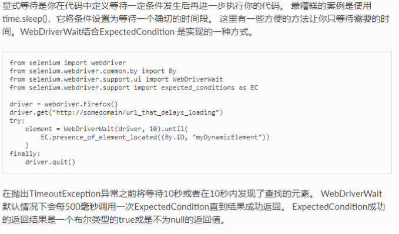
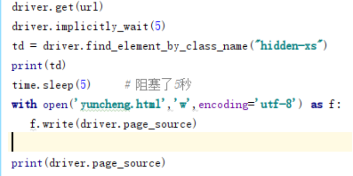

# Selenium（浏览器测试）
## 概述
Selenium是一个web的自动化测试工具，最初是为网站自动化测试而开发的，类型像我们玩游戏时用的按键精灵，可以按指定的命令自动操作，不同的是Selenium可以直接运行在浏览器上，它支持所有主流的浏览器（包括PhantomJS这些无界面的浏览器）  
[中文文档](https://selenium-python-zh.readthedocs.io/en/latest/)  
### 安装流程安装
pip install selenium  
[安装 ChromeDriver Mirror](http://npm.taobao.org/mirrors/chromedriver/)
## 操作步骤
1.导入 from selenium import webdriver  
2.driver.get("http://118.190.150.35:9000/login")  
    # 打开网址，打开需要时间，建议time.sleep()  
3.操作数据  
4.drive.quit()  关闭浏览器
## 详细操作
### 获取页面元素
```
driver.find_element_by_id('loginForm') #通过ID获取元素
driver.find_element_by_name('continue') #通过name属性获取元素
driver.find_element_by_xpath("//form[@id='loginForm']/input[4]") #通过XPath查找元素
driver.find_element_by_link_text('Continue')	#通过链接文本获取超链接
driver.find_element_by_partial_link_text('Conti')
driver.find_element_by_tag_name('h1') #通过标签名查找元素
driver.find_element_by_class_name('content') #通过Class name 定位元素
driver.find_element_by_css_selector('p.content') #通过CSS选择器查找元素
```
[详细内容](https://selenium-python-zh.readthedocs.io/en/latest/locating-elements.html#locating-elements)
### 事件
* 步骤
	* from selenium.webdriver import ActionChains  
       ``` # 导入 ActionChains 类```
	* loginbtn = driver.find_element_by_partial_link_text("登")   
      ```  # 获取元素```
	* action = ActionChains(driver)  
      ```  # 创建对象```
	* action.click(loginbtn)  
     ```   # 填写事件```
	* action.click(loginbtn).perform()  
      ```  # 执行```
* 事件方法
```
click()  单击
double_click()  双击
context_click(ac)  右击
click_and_hold()  按下
drag_and_drop(e1,e2)  将元素e1移动到e2
drag_and_drop_by_offset(e1,x,y)  将元素移动位置
release(e)  释放鼠标按钮
pause(num)  停几秒
send_keys(con)  将con发送到当前聚焦元素
send_keys_to_element(ele,con)  将con发送到元素
```
### 下拉框处理
* 步骤
	* from selenium.webdriver.support.ui import Select
        导入select类
	* select = Select（ele）
        创建选择对象
	* select_by_index(1)  
      select_by_value("0")  
      select_by_visible_rext("选择的内容")  
      deselect_all()  取消选择  
### 弹窗处理
	alert = driver.switch to alert()  获取弹框内容
### 页面切换
	driver.switch_to_alert()  获取弹窗内容
	for handle in driver.window_handles:
    driver.switch_to_window(handle)
### 页面前进和后退
	driver.forward()  #前进
    driver.back()  #后退
### Cookies
	driver.get_cookie()  # 获取cookies
	driver.delete_cookie("key")  # 删除对应cookie
	driver.delete_all_coolies()  # 删除全部cookie
### 页面等待
[详细解答](https://selenium-python-zh.readthedocs.io/en/latest/waits.html#id2)  
显式等待
  
隐式等待
  
### 瀑布流布局
dirver.execute_script()
执行JavaScript 脚本   
driver.quit()
关闭浏览器   
dirver.save_screenshot('abc.png')
页面快照   
dirver.page_source
页面源码   
案例:瀑布流布局
```
url = "https://unsplash.com/t/wallpapers"
driver.get(url)
driver.execute_script("window.scrollTo(0,2000)")        # 执行JavaScript脚本

time.sleep(5)
with open("img.html",'w',encoding='utf-8') as f:
    f.write(driver.page_source)     # 页面源码

driver.save_screenshot("img.png")       # 页面快照
driver.close()      # 关闭浏览器
```