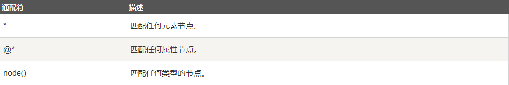
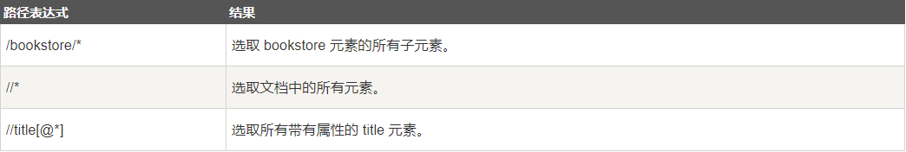
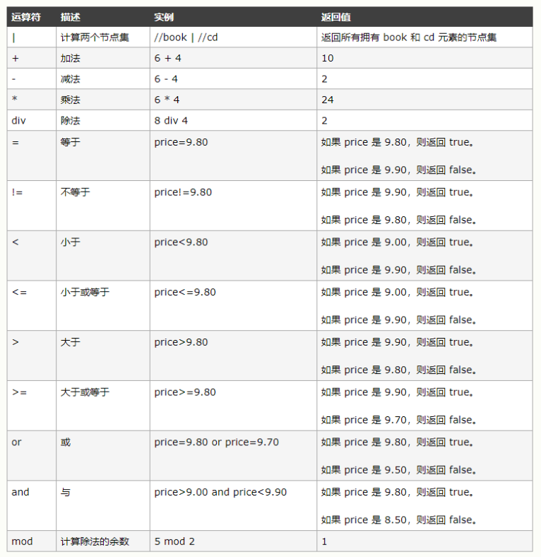
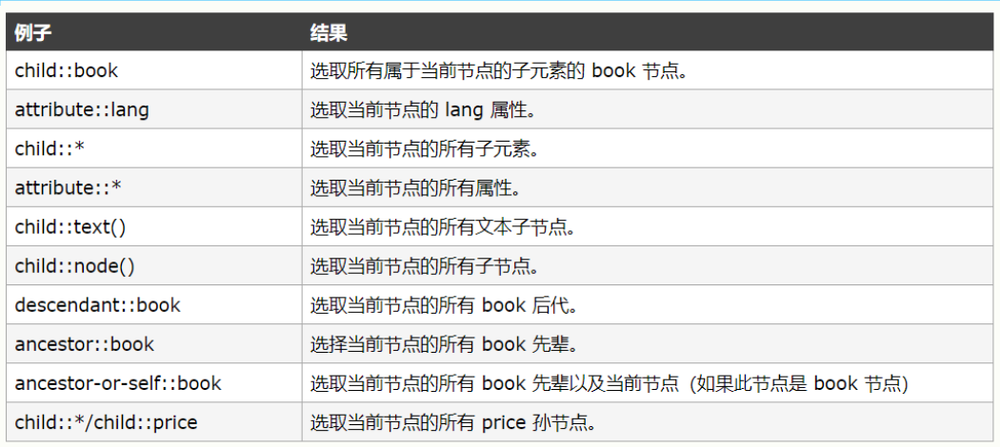
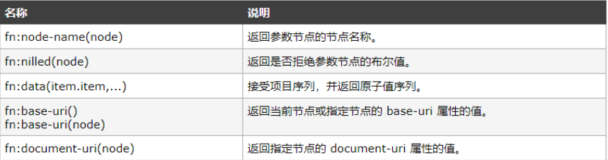
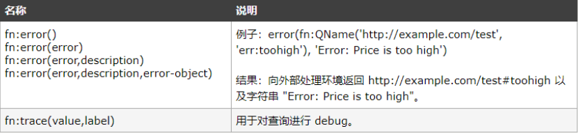
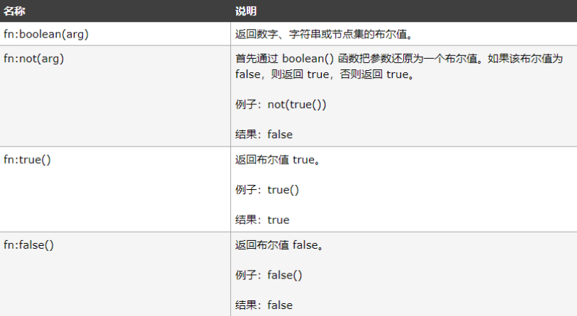
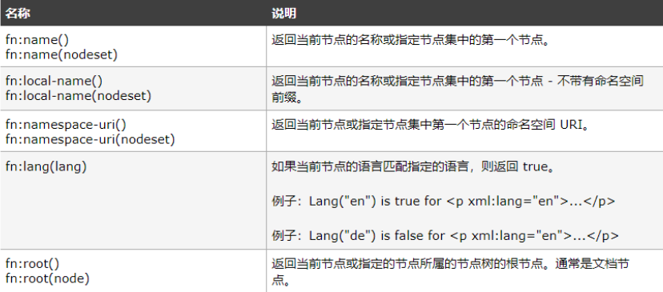
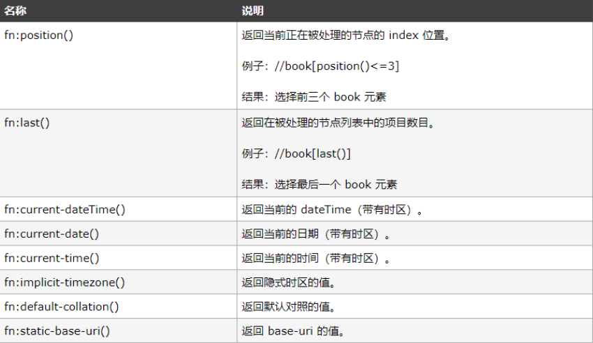

# lxml
Python 标准库中自带了 xml 模块，但是性能不够好，而且缺乏一些人性化的 API，相比之下，第三方库 lxml 是用 Cython 实现的，而且增加了很多实用的功能，可谓爬虫处理网页数据的一件利器。lxml 大部分功能都存在 lxml.etree中，所以下文都假定已经执行了
* 解析 XML 字符串  
    *网页下载下来以后是个字符串的形式，使用etree.fromstring(str)构造一个 etree._ElementTree对象，使用 etree.tostring(t)返回一个字符串
```
>>> xml_string = '<root><foo id="foo-id" class="foo zoo">Foo</foo><bar>中文</bar><baz></baz></root>'
>>> root = etree.fromstring(xml_string.encode('utf-8')) # 最好传 byte string

>>> etree.tostring(root)
# 默认返回的是 byte string
b'<root>root content<foo id="foo-id" class="foo zoo">Foo</foo><bar>Bar</bar><baz/></root>'

>>> print(etree.tostring(root, pretty_print=True).decode('utf-8'))
#decode 一下变成 unicode
<root>
  <foo id="foo-id" class="foo zoo">Foo</foo>
  <bar>Bar</bar>
  <baz/> # 注意这里没有子节点的 baz 节点被变成了自闭和的标签
</root>

>>> type(root)
<class 'lxml.etree._Element'>

# 可以看出 tostring 返回的是一个_Element类型的对象，也就是整个 xml 树的根节点
```
* Element结构
    * etree._Element 是一个设计很精妙的结构，可以把他当做一个对象访问当前节点自身的文本节点，可以把他当做一个数组，元素就是他的子节点，可以把它当做一个字典，从而遍历他的属性
```
>>> root.text
'root content' # 注意只是 root 自身的文本，并不包含子节点的文本
>>> root.tag
'root'
>>> root[0].tag
'foo'
>>> foo = root[0]
>>> for attr, val in foo.items():
...     print(attr, val)
...
id foo-id
class foo zoo
>>> foo.get('id')
'foo-id'
>>> foo.attrib
{'class': 'foo zoo', 'id': 'foo-id'}
```
* Element 和 ElementTree
    * xml 是一个树形结构，lxml 使用etree._Element和 etree._ElementTree来分别代表树中的节点和树，etree.ELement和 etree.ElementTree 分别是两个工厂函数
```
>>> t = root.getroottree()
# 获得一个节点对应的树
<lxml.etree._ElementTree object at 0x107295308>

>>> t.getroot() == root
# 使用getroot 返回一个树的根节点
True

>>> foo_tree = etree.ElementTree(root)
# 也可以从一个节点构造一个树，那么这个节点就是这棵树的根
>>> foo_tree.getroot().tag
'foo'

>>> foo.getroottree().tag
'root'
```
## Xpath常用规则
### 简介
* XPath 使用路径表达式在 XML 文档中进行导航  
    * XPath 使用路径表达式来选取 XML 文档中的节点或者节点集。这些路径表达式和我们在常规的电脑文件系统中看到的表达式非常相似。
* XPath 包含一个标准函数库  
    * XPath 含有超过 100 个内建的函数。这些函数用于字符串值、数值、日期和时间比较、节点和 QName 处理、序列处理、逻辑值等等。  
* XPath 是 XSLT 中的主要元素  
* XPath 是一个 W3C 标准
    * XPath 于 1999 年 11 月 16 日 成为 W3C 标准。  
### 安装
	pip install lxml
    from lxml import etree
### 节点
* 定义：在 XPath 中，有七种类型的节点：元素、属性、文本、命名空间、处理指令、注释以及文档（根）节点。XML 文档是被作为节点树来对待的。树的根被称为文档节点或者根节点。  
### 语法
* XPath 使用路径表达式来选取 XML 文档中的节点或节点集。节点是通过沿着路径 (path) 或者步 (steps) 来选取的。  
* 选取节点 

表达式|描述
--|--
nodename|选取此节点的所有子节点。
|
/|从根节点选取。
|
//|从匹配选择的当前节点选择文档中的节点，而不考虑它们的位置。
|
.|选取当前节点。
|
..|选取当前节点的父节点。
|
@|选取属性。

路径表达式|	结果
--|--
bookstore	|选取 bookstore 元素的所有子节点。
|
/bookstore	}|选取根元素 bookstore。注释：假如路径起始于正斜杠( / )，则此路径始终代表到某元素的绝对路径！
|
bookstore/book	|选取属于 bookstore 的子元素的所有 book 元素。
|
//book	|选取所有 book 子元素，而不管它们在文档中的位置。
|
bookstore//book	|选择属于 bookstore 元素的后代的所有 book 元素，而不管它们位于 bookstore 之下的什么位置。
|
//@lang	|选取名为 lang 的所有属性。





### 举例
```
from lxml import etree

str1 = """
<html>
<div class="box">
    <ul>
        <li class='item0'>
            <a class='link0' herf='https://www.baidu.com/'>百度</a>
        </li>
        <li class='item0'>
            <div></div>
            <a class='link1' herf='https://www.sxuek.com/'>优逸客</a>
        </li>
    </ul>
<div></div>
</html>
"""

html = etree.HTML(str1)     # 类
# print(html)     # 实例化出一个具体的对象

# root = html.xpath("/html")        # xpath 遵循xpath规则，从当前文档的根开始寻找,root 是一个集合
# root = html.xpath("/div")      # div标签名，从根开始找(找不见)
# root = html.xpath("//div")      # 从当前节点找，任意位置，后加上标签名div
# root = html.xpath("//a")
# print(root)     # root 是一个集合

# link = html.xpath("a")
# print(link[0].text)

links = html.xpath("//div/ul/li/a")
for item in links:
    # print(dir(item))
    print('text',item.text)
    print('xpath',item.xpath)
    print('sourceline',item.sourceline)
    print('tag',item.tag)
    print('tail',item.tail)
```
### 节点轴
```
## XPath 轴
# links = html.xpath("//div/ul/li/child::div")      # li 下面所有的 div
# print(links)

# links = html.xpath("//div/ul/li/attribute::class")      # li 下面所有的 class类名
# print(links)

# links = html.xpath("//div/ul/li/child::text()")      # li 下面所有的子类的内容
# print(links)

# links = html.xpath("//div/ul/li[last()]/child::*")      # li 下面所有的子元素
# print(links)

# links = html.xpath("//div/ul/li/child::node()")      # li 下面所有的子元素
# print(links)

# links = html.xpath("//div/ul/li/descendant::*")      # li 下面所有的后代元素
# print(links)

# links = html.xpath("//div/ul/parent::*")      # ul 父元素
# print(links)

# links = html.xpath("//div/ul/ancestor::*")      # ul 所有的祖先元素
# print(links)

# links = html.xpath("//div/ul/li[last()]/a/preceding::*")      # 当前元素之前的所有节点
# print(links)
```

### 常用函数
* contains（）
    ```
	# links = html.xpath("//div/ul/li/a[@class='link1 link3']")      #  直接用类名获取元素，两个类名都得写
    
    # print(links)

    # links = html.xpath("//div/ul/li/a[contains(@class,'link1')]")      #  用contains获取元素，只要写一个类名就可以
    # print(links)
    ```
* last（）
```
	links = html.xpath("//div/ul/li[position()<last()]/a/text()")      # [position()]里是条件，获取拥有特点元素值的节点
print(links)
```
### 其他函数
* 存取函数

* 错误和跟踪函数

* 关于布尔值的函数

* 关于节点的函数

* 上下文函数

* 字符串函数
```
fn:string(arg)	返回参数的字符串值。参数可以是数字、逻辑值或节点集。例子：string(314)结果："314"
fn:codepoints-to-string(int,int,...)	根据代码点序列返回字符串。例子：codepoints-to-string(84, 104, 233, 114, 232, 115, 101)结果：'Thérèse'
fn:string-to-codepoints(string)	根据字符串返回代码点序列。例子：string-to-codepoints("Thérèse")结果：84, 104, 233, 114, 232, 115, 101
fn:codepoint-equal(comp1,comp2)	根据 Unicode 代码点对照，如果 comp1 的值等于 comp2 的值，则返回 true。(http://www.w3.org/2005/02/xpath-functions/collation/codepoint

)，否则返回 false。
fn:compare(comp1,comp2)
fn:compare(comp1,comp2,collation)如果 comp1 小于 comp2，则返回 -1。如果 comp1 等于 comp2，则返回 0。如果 comp1 大于 comp2，则返回 1。（根据所用的对照规则）。例子：compare('ghi', 'ghi')结果：0
fn:concat(string,string,...)	返回字符串的拼接。例子：concat('XPath ','is ','FUN!')结果：'XPath is FUN!'
fn:string-join((string,string,...),sep)	使用 sep 参数作为分隔符，来返回 string 参数拼接后的字符串。例子：string-join(('We', 'are', 'having', 'fun!'), ' ')结果：' We are having fun! '
fn:substring(string,start,len)
fn:substring(string,start)返回从 start 位置开始的指定长度的子字符串。第一个字符的下标是 1。如果省略 len 参数，则返回从位置 start 到字符串末尾的子字符串。例子：substring('Beatles',1,4)结果：'Beat'
fn:string-length(string)
fn:string-length()	返回指定字符串的长度。如果没有 string 参数，则返回当前节点的字符串值的长度。例子：string-length('Beatles')结果：7
fn:normalize-space(string)
fn:normalize-space()	删除指定字符串的开头和结尾的空白，并把内部的所有空白序列替换为一个，然后返回结果。如果没有 string 参数，则处理当前节点。例子：normalize-space(' The   XML ')结果：'The XML'
fn:normalize-unicode()	执行 Unicode 规格化。
fn:upper-case(string)	把 string 参数转换为大写。例子：upper-case('The XML')结果：'THE XML'
fn:lower-case(string)	把 string 参数转换为小写。例子：lower-case('The XML')结果：'the xml'
fn:translate(string1,string2,string3)	把 string1 中的 string2 替换为 string3。例子：translate('12:30','30','45')结果：'12:45'
fn:escape-uri(stringURI,esc-res)	例子：escape-uri("http://example.com/test#car", true())结果："http%3A%2F%2Fexample.com%2Ftest#car"
fn:contains(string1,string2)	如果 string1 包含 string2，则返回 true，否则返回 false。例子：contains('XML','XM')结果：true
fn:starts-with(string1,string2)	如果 string1 以 string2 开始，则返回 true，否则返回 false。例子：starts-with('XML','X')结果：true
fn:ends-with(string1,string2)	如果 string1 以 string2 结尾，则返回 true，否则返回 false。例子：ends-with('XML','X')结果：false
fn:substring-before(string1,string2)	返回 string2 在 string1 中出现之前的子字符串。例子：substring-before('12/10','/')结果：'12'
fn:substring-after(string1,string2)	返回 string2 在 string1 中出现之后的子字符串。例子：substring-after('12/10','/')结果：'10'
fn:matches(string,pattern)	如果 string 参数匹配指定的模式，则返回 true，否则返回 false。例子：matches("Merano", "ran")结果：true
fn:replace(string,pattern,replace)	把指定的模式替换为 replace 参数，并返回结果。例子：replace("Bella Italia", "l", "*")结果：'Be**a Ita*ia'
fn:tokenize(string,pattern)	例子：tokenize("XPath is fun", "\s+")结果：("XPath", "is", "fun")

```
## 组件
* etree（文档树）
	* HTML初始化生成一个XPath解析
	* tostring（html，encoding=''）
	* xpath() 通过获取路径来获取资源