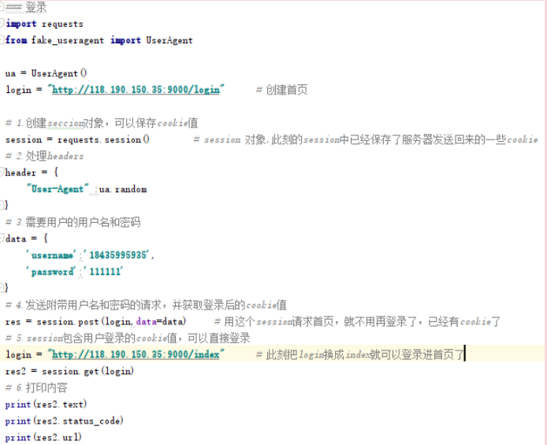
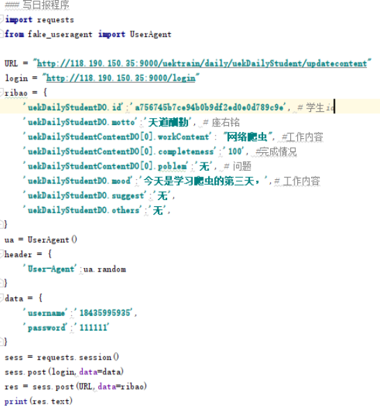

# requests包
通过urllib底层实现（在urllib的基础上进行更好的封装）  
[python requests官网](http://docs.python-requests.org/zh_CN/latest/)
## GET请求
* get(URL,params,headers,timeout)
	* res = requests.get('www.baidu.com')   响应一个地址
	* res.text  查看响应内容
    * res.content  字节流
    * res.url  完整的地址
    * res.encoding  响应字符编码
    * res.status_code  响应码
## POST请求
* post(URL,data,header={})
	* data={}
	* res.text  
      res.json()  显示json
## 代理
```
	proxies = {"http":"http：//12.34.56.79:9527"}
response = response.get("http://www.baidu.com",proxies = proxies)
		proxie = {
        'http':'http://%s'%ip,
        'https': 'https://%s'%ip,
    }
		requests.get('http://wwww.baidu.com',proxies=proxie,timeout=10)     # 请求百度，测试ip地址是否可用
```
* 本地配置代理
		export HTTP_PROXY="http://12.34.56.79.9527"
		export HTTPS_PROXY="https://12.34.56.79.9527"
## cookie和session（保存在浏览器的数据）
* 包中利用cookie以及session来实现登录
  
* 日报  
日报系统中找到学生id
可以在布局里找，也可以在updatecontent里找，就是提交两次可以出现。
 
* 获取cookie
```
res = sess.post("http://118.190.150.35:9000/login",data=data)
coo = sess.cookies
cookiesDict = requests.utils.dict_from_cookiejar(coo)
print(cookiesDict)
```
## 处理HTTPS请求SSL证书验证
response = requests.get("https://www.baidu.com/",verify=True)  
跳过验证 verify=False （默认）