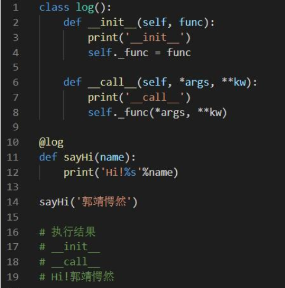

# 装饰器
## 定义
装饰器实际上就是为了给某个程序增加功能
## 使用场景
* 定义公式：<函数+实参高阶函数+返回值高阶函数+闭包函数+语法糖=装饰器>
* 比如该程序已经上线或者已经被使用，那么久不能大批量地修改源代码，这样是不科学也是不现实的。
## 装饰器三原则
* 不能修改被装饰函数的源代码
* 不能改变被装饰函数的调用方式
* 满足1、2的情况下给程序增加功能
## 添加新功能：输出总时间
```
import time 
# def fn():   #所有的函数必须放在前面 ；定义好了写到内存中，没执行
#     time.sleep(1)
#     print("end..")
# fn()

# 方式一
# def fn2(fn1):    # 局部的fn1  调用完fn2应该注释掉内部的变量
#     def newFn():
#         start = time.time()
#         fn1()    # 函数的闭包，内层函数使用外层变量fn1
#         end = time.time()
#         print("总时间：%s"%(end-start))
#     return newFn    # 返回newFn给fn2，相当于此时的fn2就是newFn了；注意这里不是返回newFn()
# fn = fn2(fn)    # 开始的fn是全局的fn作为实参给fn2，执行将newFn给fn2，把原来上边的fn覆盖了而存储成了newFn，然后再把fn2赋给此刻的fn
# fn()
```

```
# 方式二：装饰器语法
# def fn2(fn1):
#     def newFn():
#         start = time.time()
#         fn1()
#         end = time.time()
#         print("总时间：%s"%(end-start))
#     return newFn

# @fn2
# def fn():
#     time.sleep(1)
#     print("end..")

# @fn2
# def fn1():
#     print("abc")

# fn()
# fn1()
```
## 装饰器的传参
### 原函数传参
```
def fn2(fn1):
    def newFn(*args,**kwargs):
        start = time.time()
        fn1(*args,**kwargs)   # 解构一下
        end = time.time()
        print("总时间：%s"%(end-start))
    return newFn

@fn2
def fn(name):
    time.sleep(1)
    print("my name is %s"%name)

fn("wss"
```
### 装饰器传参
```
def fn2(funName):
    def argsfn(fn):
        def newFn(*args,**kwargs):
            print("这是装饰(%s)函数"%funName)
            start = time.time()
            fn(*args,**kwargs)   # 接收参数
            end = time.time()
            print("总时间：%s"%(end-start))
        return newFn
    return argsfn

@fn2('fn函数')
def fn(name):
    time.sleep(1)
    print("my name is %s"%name)

fn("wss")
```
## 装饰器嵌套
```
@fn2()
@fn1()
def fn():
    pass
```

```
# 定义@fn1装饰器：输出装饰器名字
def fn1(funName1):
    print("%s在执行装饰器"%funName1)
    def newFun(fn):
        def newFun2(*args,**kwargs):
            print("%s在调用"%funName1)
            fn(*args,**kwargs)
        return newFun2
    return newFun

# @fn2装饰器  输出装饰器的名字
def fn2(funName2):
    print("%s在执行装饰器" % funName2)
    def newFun(fn):
        def newFun2(*args,**kwargs):
            print("%s在调用"%funName2)
            fn(*args,**kwargs)
        return newFun2
    return newFun

@fn2("fun2")
@fn1("fun1")
def fn(name):
    print(name)

fn("wss")
```
**了解装饰器运行流程: 装饰器执行是按照从上到下执行**
## 装饰器高级
### 类装饰器
类装饰的工作流程可以分为两部分：装饰阶段和调用阶段。解释器一遇到“@log”语句时就会完成对sayHi( )函数的装饰，即调用log类的__init__( )方法；当代码执行到sayHi( )时，会执行装饰类log的__call__( )方法，实现对sayHi( )函数的调用。

案例
```
def MyClass(obj):
    obj.age = 19        # 类变量
    obj.say = lambda cls:print(cls.age)     # 类方法
    return obj

@MyClass
class P:
    def __init__(self,name):
        self.name = name
class A:

p = P("小红")
print(dir(p))
```
### 实例方法装饰器
```
import time

def sumtime(fn):
    def newFn(self,*args,**kwargs):
        start = time.time()
        fn(self,*args,**kwargs)
        end = time.time()
        print("%s你好帅"%self.name)
        print("总时间：%s"%(end-start))
    return newFn
## 实例方法装饰器
class P:
    def __init__(self,name):
        self.name = name
    @sumtime
    def run(self):
        time.sleep(1)
        print(self.name)

p = P("wss")
p.run()
```